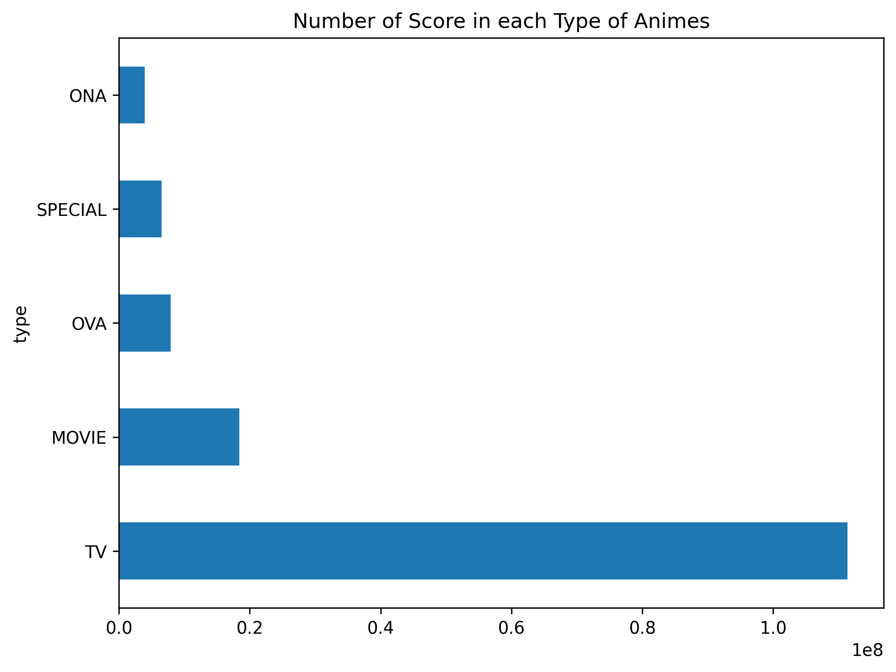
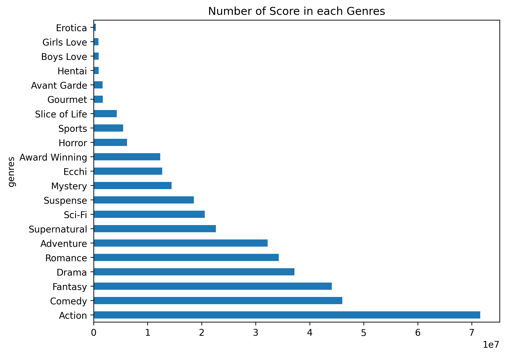

# User Anime Dataset — Rating Analysis


## 概要

Kaggleの「User Anime Dataset」を用いて、作品メタ情報とユーザのレーティングから、

アニメ作品の人気タイトルや、その傾向・要因など分析し、集計・可視化しました。


## 主要結果（ダイジェスト）

- 放送形式ごとの、評価の投稿数の違い（図1）

- 続編か否かによる、評価の投稿数の違い（図2）

- ジャンルごとの投稿数の違い（図3）








## データ

本プロジェクトでは、Kaggle の「User Anime Dataset」を利用しています。


- 出典: \[Kaggle — User Anime Dataset](https://www.kaggle.com/datasets/tavuksuzdurum/user-animelist-dataset)

- ライセンス: CC BY 4.0 (Creative Commons Attribution 4.0 International)


本リポジトリにはデータセットそのものは含まれていません。  

ご利用の際は、Kaggle 上の配布元からライセンス条件に従って直接ダウンロードしてください。


## 再現手順


### 1. 環境構築

```bash

python -m venv .venv \&\& . .venv/Scripts/activate  # Windowsの場合

pip install -r requirements.txt

```

### 2. データ配置
kaggleからzipファイルをダウンロードして解凍 → data/raw/ に配置


